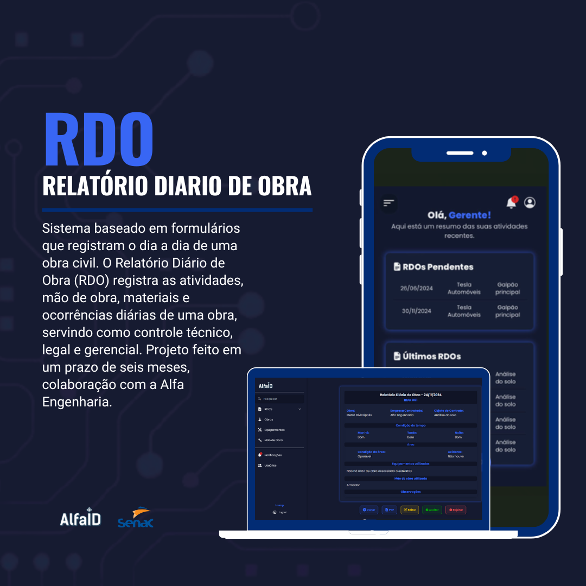

# 🏗️ RDO - Relatório Diário de Obra

Sistema web baseado em formulários que registram o dia a dia de uma obra civil.  
O **RDO (Relatório Diário de Obra)** permite o controle técnico, legal e gerencial da obra, registrando:

- ✅ Atividades diárias  
- 👷‍♂️ Mão de obra alocada  
- 🧱 Materiais utilizados  
- ⚠️ Ocorrências e imprevistos  
- 📊 Relatórios completos por data

---

## 🚀 Sobre o Projeto

Este projeto foi desenvolvido como parte de um trabalho de curso no **SENAC MG**, com colaboração da **Alfa Engenharia**.  
O sistema foi pensado para facilitar o acompanhamento das obras, com acesso simplificado tanto pelo desktop quanto por dispositivos móveis.

> ⏳ Projeto com prazo de 6 meses de desenvolvimento.

---

## 🛠️ Tecnologias Utilizadas

- **PHP 8** + **Laravel**
- **MySQL** para persistência de dados
- **AdminLTE** como template administrativo
- **Tailwind CSS** para estilização adicional
- **JavaScript** para interações dinâmicas

---

## 📷 Funcionalidades

- 📝 Cadastro e edição de RDOs  
- 👷 Gerenciamento de equipes e mão de obra  
- 🧾 Registro de materiais utilizados  
- ⏰ Controle de datas e status dos relatórios  
- 📱 Layout responsivo para mobile e desktop

---

## 🧠 Contribuições e Aprendizados

Durante o desenvolvimento deste projeto, adquiri experiência com:

- Organização e estruturação de sistemas Laravel com base no padrão MVC  
- Conexão e manipulação de banco de dados MySQL  
- Criação de layouts administrativos utilizando o AdminLTE  
- Aplicação de estilos personalizados com Tailwind CSS  
- Responsividade e adaptação da interface para diferentes dispositivos  
- Planejamento e execução de um projeto completo em colaboração com uma empresa real  

---

## 👨‍💻 Autores

**Gabriel Jacobis - BackEnd** 
Estudante de Desenvolvimento de Sistemas – SENAC MG  
Fascinado pela tecnologia, buscando me tornar um desenvolvedor full stack.

- GitHub: [@GabrielJacobis](https://github.com/GabrielJacobis)
- LinkedIn: [https://linkedin.com/in/seu-perfil](https://www.linkedin.com/in/gabriel-jacobis-9a4bb3115/))

**Willian Viana - FrontEnd**  
Estudante de Desenvolvimento de Sistemas – SENAC MG  
Apaixonado por tecnologia, buscando me tornar um desenvolvedor full stack.

- GitHub: [@vianawill](https://github.com/vianawill)  
- LinkedIn: [https://linkedin.com/in/seu-perfil](https://www.linkedin.com/in/willian-viana-667015328)

---

🛠 Projeto acadêmico — **SENAC MG**  
🤝 Em parceria com **Alfa Engenharia**
